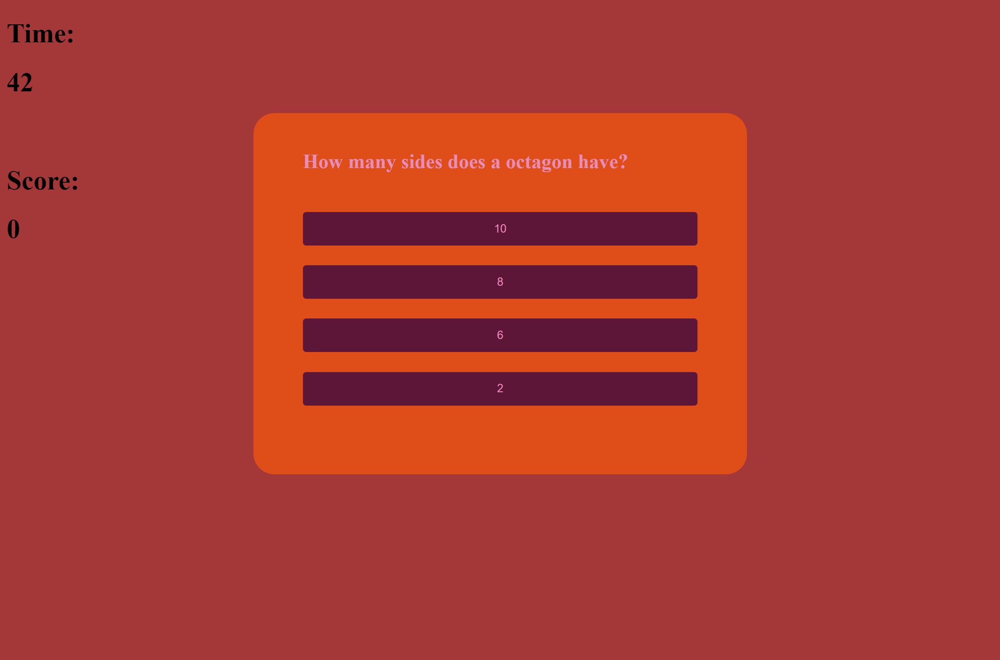
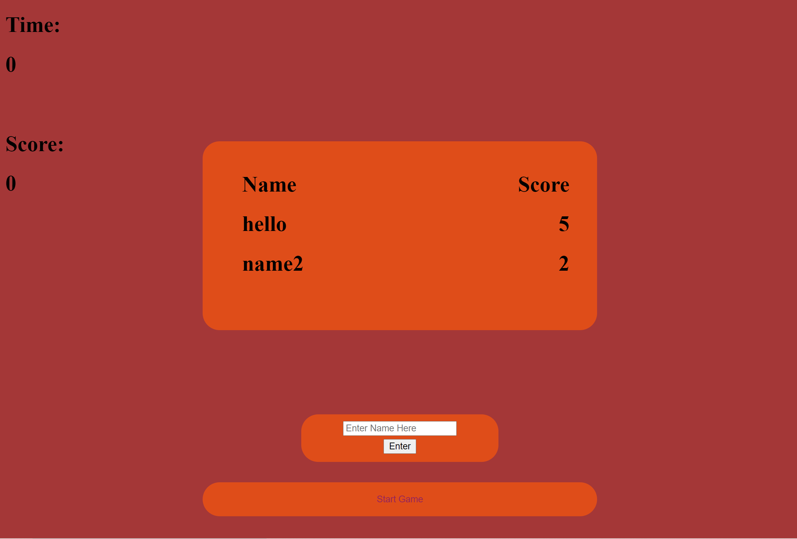

# Homework 4: Code Quiz

## Objective 

Create a online quiz-taking platform with 1 quiz with an integrated scoreboard.

## Changes

There are comments in the code that highlight how the algorithm works on less of a surface level, but for the sake of keeping this readable, I will just put a surface-level description here.

A data structure (Object list) holds all the questions and their answers value, and there are functions in the Javascript that set the html to display those questions. An index variable determines which question you are on and decrements each time you answer a question right or wrong. When you either run out of time or answer all of the questions, the game ends and the scores are input into local storage when your name in entered in the text field. Since this application is only one page, I made use of the display: none styling attribute extensively to hide elements that needed to be hidden for various parts of the quiz.

## Screenshots

Quiz

Scoreboard

## Links

[Webpage](https://andrewtrudeau.github.io/04-code-quiz/)

[Github](https://github.com/andrewtrudeau/04-code-quiz)